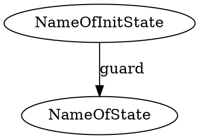
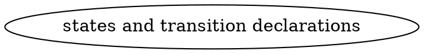

# Graph2Strat

A program used to compile dot graph snippets into state machine directly used within python code.

Originally a tool for the ENACRobotique robotics club.

[](https://replit.com/@KirrimK/graph2strat)

## Installation

Until OCaml and Opam support Windows completely, this program is Linux only.

### Via Opam
Install ocaml and opam from your package manager.
Then using opam, configure an additionnal repo:
```bash
opam repo add KirrimK https://github.com/KirrimK/opam-repo.git
```
Then install the compiler:
```bash
opam update
opam install graph2strat
```

### Standalone release
Download the latest executable from the [Releases page](https://github.com/KirrimK/graph2strat/releases).

Place it in your desired directory, and make it executable: 
```
sudo chmod +x ./g2s-vx.x.x-github-musl.x86_64
```

You can now run it in a terminal:

```
$ ./g2s.vx.x.x-github-musl.x86_64
Graph2strat by KirrimK version x.x.x (Build type: github-static-musl)
Usage: ./g2s.vx.x.x-github-musl.x86_64 <dot_input_file> [-o <python_output_file>]
```

## Build from source

Clone this repo, then using opam, install the required dependencies: `dune`, `menhir`, `dune-build-info` (and `odoc` for the documentation).
Then run `dune build` to build the compiler.
Run the build using `_build/default/bin/main.exe <input_file> [-o <output_file>]`.

OCaml code documentation is at [https://kirrimk.github.io/graph2strat/](https://kirrimk.github.io/graph2strat/) and can be generated using `dune build @doc`.
Automated tests can be run using `dune runtest`.

## Usage

If you installed the compiler using opam, you can run it using `g2s <dot_input_file> [-o <python_output_file>]`.
This will generate a file named `<dot_input_file>_g2s.py` containing the generated python file in the current folder.

You can also specify the output file using the '-o' option.

It will take files using this format:


Import the corresponding generated file in your python code, and use it like this:
```python
from <name_of_generated_file> import G2S

class Parent:
    # Write here the code for your parent object, it will be passed to the state machine
    def on_enter(self, local, name_previous_state: str) -> None:
        print("on_enter")
    def on_leave(self, local, name_next_state: str) -> None:
        print("on_leave")
    def on_loop(self, local) -> None:
        print("on_loop")
    def guard(self, local) -> bool:
        print("guard")
        return True

my_parent_object = Parent()
my_stm = G2S(my_parent_object, debug=True)
my_stm.start() # start the state machine, on_enter for the initial state will be called
my_stm.step() # calls on_loop of the current state, and checks for transitions
...
```

## State machine declaration syntax

Here is the structure your dot file should have:


### States

States are declared using the following syntax:

```dot
NameOfState [comment="type:function_name;..."] // explicitely declares a state
```

Here are examples of valid callbacks to specify in the comment field:

- `enter:function_name`: the function `function_name` will be called when entering the state
- `leave:function_name`: the function `function_name` will be called when leaving the state
- `loop:function_name`: the function `function_name` will be called repeatedly while in the state and at least once

Combine all those by separating them with a semicolon, in any order:
`enter:function_name;leave:function_name;loop:function_name`

#### State callbacks

The on_enter function should have the following signature:
```python
# in the parent object

    def on_enter(self, local, name_previous_state: str) -> None:
        # do stuff
        pass

```

The on_leave function should have the following signature:
```python
# in the parent object

    def on_leave(self, local, name_next_state: str) -> None:
        # do stuff
        pass

```

The on_loop function should have the following signature:
```python
# in the parent object

    def on_loop(self, local) -> None:
        # do stuff
        pass

```

The local variable is an object that you can use to stored temporary variables while being in a state:
it is created when entering a state, destroyed when leaving it and passed to the loop and guard functions.

### Transitions

Transitions are declared using the following syntax:
```dot
NameOfInitState -> NameOfState [label="function_name"] // declares a transition from NameOfInitState to NameOfState that checks the guard against function_name

{StateA StateB StateC ...} -> NameOfState [label="function_name"] // declares a transition from multiple states to NameOfState that checks the guard against function_name

```

You can also check the test folder for examples.

#### Transition guard

The guard is expected to have the following signature:
```python
# in the parent object

    def guard(self, local) -> bool:
        if <should_activate_transition>:
            return True
        else:
            return False
```


## Bugs/limits:

Don't declare nodes with the same name but different caracteristics, it's a bad practice anyway.
State names cannot be 1 character long.

Partial auto testing is done, but please check that the output seems to correspond to the input.
If a bug is found, please file an issue on the github page.

## Project TODOs

- improve error messages
