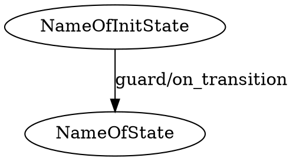
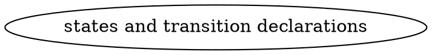

# Graph2Strat compiler

A program used to compile dot graph snippets into state machine directly used within python code.

Originally a tool for the ENACRobotique robotics club.

[](https://replit.com/@KirrimK/graph2strat)

## Installation

(Linux only)
Install ocaml and opam from your package manager.
Then using opam, configure an additionnal repo:
```bash
opam repo add KirrimK https://github.com/KirrimK/opam-repo.git
```
Then install the compiler:
```bash
opam update
opam install graph2strat
```

## Build from source

Clone this repo, then using opam, install the required dependencies: dune, menhir, re2.
Then run `dune build` to build the compiler.
Run the build using `_build/default/bin/main.exe <input_file> [-o <output_file>]`.

OCaml code documentation is at [https://kirrimk.github.io/graph2strat/](https://kirrimk.github.io/graph2strat/) and can be generated using `dune build @doc`.
Automated tests (once added) can be run using `dune runtest`.

## Usage

If you installed the compiler using opam, you can run it using `g2s <dot_input_file> [-o <python_output_file>]`.
This will generate a file named `<dot_input_file>_g2s.py` containing the generated python file in the current folder.

You can also specify the output file using the '-o' option, and the statemachine library will be added in the same folder.

It will take files using this format:


The following code containing your statemachine will be generated:

```python
# Generated by graph2strat v0.8.0 by KirrimK@ENAC
# Report any issues on github: KirrimK/graph2strat
# Do not edit this auto-generated file manually
import typing

# Statemachine library preincluded in G2S file
class Transition:
    ...

class State:
    ...

class StateMachine:
    ...

# start of G2S machine
class G2S:
    def __init__(self, parent: typing.Any, debug=False):
        self.name = "stm_STM_NAME"
        self.parent = parent
        self.debug = debug
        self.started = False
        self.NameOfState = State("NameOfState", self.parent.on_enter, self.parent.on_leave)
        self.NameOfInitState = State("NameOfInitState")
        self.NameOfInitStateToNameOfState = Transition("NameOfInitStateToNameOfState", self.NameOfState, self.parent.guard, self.parent.on_transition)
        self.NameOfInitState.add_transition(self.NameOfInitStateToNameOfState)
        self.stm_STM_NAME = StateMachine(self.NameOfInitState)

    def __str__(self):
        ...

    def start(self):
        ...
    
    def check_transitions(self):
        ...
```

import the generated file in your python code, and use it like this:
```python
from <name_of_generated_file> import G2S

class Parent:
    # Write here the code for your parent object, it will be passed to the state machine
    def on_enter(self):
        print("on_enter")
    def on_leave(self):
        print("on_leave")
    def guard(self):
        print("guard")
        return True
    def on_transition(self):
        print("on_transition")

my_parent_object = Parent()
my_stm = G2S(my_parent_object, debug=True)
my_stm.start() # start the state machine, on_enter for the initial state will be called
my_stm.check_transitions() # check if a transition can be made, on_transition will be called if a transition is made
...
```

## State machine declaration syntax

Here is the structure your dot file should have:


### States

States are declared using the following syntax:
```dot
NameOfState [comment="on_enter/on_leave"] // declares a state named NameOfState, with on_enter and on_leave methods

NameOfState [comment="on_enter"] // declares a state named NameOfState, with only an on_enter method

NameOfState [comment=""] // declares a state named NameOfState that doesn't do anything
```

### Transitions

Transitions are declared using the following syntax:
```dot
NameOfInitState -> NameOfState [label="guard/on_transition"] // declares a transition from NameOfInitState to NameOfState, with guard and on_transition methods

NameOfInitState -> NameOfState [label="on_transition"] // declares a transition from NameOfInitState to NameOfState, with only a transition action

NameOfInitState -> NameOfState [label=""] // declares a transition from NameOfInitState to NameOfState that doesn't do anything

{StateA StateB StateC ...} -> NameOfState [label="guard/on_transition"] // declares a transition from multiple states to NameOfState, with guard and on_transition methods

{StateA StateB StateC ...} -> NameOfState [label="on_transition"] // declares a transition from multiple states to NameOfState, with only a transition action

{StateA StateB StateC ...} -> NameOfState [label=""] // declares a transition from multiple states to NameOfState that doesn't do anything
```

You can also check the test folder for examples.

## Bugs/limits:

Don't declare nodes with the same name but different caracteristics, it's a bad practice anyway.

Extensive testing hasn't been done yet, check that the output seems to correspond to the input.
If a bug is found, please file an issue on the github page.

## Project TODOs

- improve error messages
- improve testing
